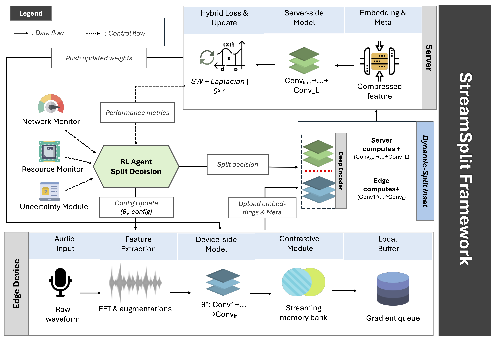

# StreamSplit: Theoretical Guarantees for Edge Audio Learning

[](https://www.python.org/downloads/)
[](https://pytorch.org/)
[](https://opensource.org/licenses/MIT)
[](https://arxiv.org/abs/2025.XXXXX)

## Overview

StreamSplit is a novel framework for real-time continuous audio representation learning at the edge. It addresses the limitations of centralized methods under extreme computational, memory, and bandwidth restrictions by providing a streaming contrastive learning approach with dynamic edge-server computation splitting.

## Architecture



*Figure 1: End-to-end overview of StreamSplit showing the edge-server processing pipeline with dynamic computation splitting.*

### Key Components

The StreamSplit framework consists of three main components:

1. **Edge Device Processing**
   - Raw audio acquisition with FFT & augmentations
   - Adaptive feature extraction based on available resources
   - Device-side model execution (Conv1→...→Convk)
   - Streaming memory bank with contrastive learning
   - Local buffer and gradient queue management

2. **Dynamic Split Decision**
   - RL Agent monitoring system resources and network conditions
   - Uncertainty Module assessing embedding quality
   - Performance metrics feedback loop
   - Real-time split point adjustment within the deep encoder

3. **Server-Side Processing**
   - Completion of model inference (Convk+1→...→ConvL)
   - Hybrid loss computation (Sliced-Wasserstein + Laplacian)
   - Global model updates and weight synchronization
   - Embedding metadata management

## Key Features

- **Streaming Contrastive Framework**: Learn from embedding distributions with theoretical convergence guarantees
- **Hybrid Loss Function**: Combines Sliced-Wasserstein distance with Laplacian regularization
- **Dynamic Computation Splitting**: Adaptively distributes workload between edge and server based on resources
- **Theoretical Guarantees**: Proven convergence bounds for both convex and non-convex cases
- **Edge Optimization**: Optimized for resource-constrained devices like Raspberry Pi

## Performance

- **Accuracy**: 97.8% of server-only performance (within 2% gap)
- **Bandwidth Reduction**: 77.1% less than server-only approach
- **Latency Reduction**: 72.6% lower than server-only processing
- **Energy Savings**: 52.3% reduction compared to edge-only methods

## Installation

### Prerequisites

- Python 3.8+
- PyTorch 1.9+
- NumPy
- SciPy
- librosa (for audio processing)
- Raspberry Pi 4B (for edge deployment)

### Quick Install

```bash
git clone https://github.com/mk3658/streamsplit.git
cd streamsplit
pip install -r requirements.txt
pip install -e .
```

### Hardware Requirements

**Edge Device (Minimum):**
- Raspberry Pi 4B with 4GB RAM
- USB 2.0 microphone
- Wi-Fi/cellular connectivity (0.5+ Mbps)

**Server:**
- Multi-core CPU (x86_64 or ARM64)
- 16GB+ RAM
- GPU recommended for faster processing
- High-speed network connection

## Quick Start

### Basic Usage

```python
from streamsplit import StreamSplit, EdgeConfig, ServerConfig, SplitConfig

# Configure components
edge_config = EdgeConfig(
    model_path="models/mobilenet_edge.pth",
    memory_bank_size=512,
    temperature=0.1
)

server_config = ServerConfig(
    model_path="models/mobilenet_server.pth",
    batch_size=256,
    num_prototypes=100
)

split_config = SplitConfig(
    reward_weights=(1.0, 0.5, 0.3, 0.2)
)

# Initialize framework
framework = StreamSplit(edge_config, server_config, split_config)

# Process audio stream
audio_stream = load_audio_stream("continuous_audio.wav")
result = framework.process_audio_stream(audio_stream)

print(f"Accuracy: {result.accuracy:.2f}%")
print(f"Bandwidth used: {result.bandwidth_usage:.2f} MB/hour")
```

### Edge-Only Processing

```python
from streamsplit.edge import StreamingContrastiveModule, AdaptiveFeatureExtractor

# Initialize edge module
edge_module = StreamingContrastiveModule(
    model_config=edge_config,
    memory_bank_size=512,
    temperature=0.1
)

# Process audio on edge
features = edge_module.extract_features(audio_segment)
embeddings = edge_module.forward(features)
loss = edge_module.compute_local_loss(anchor, positive, negatives)
```

### Dynamic Splitting

```python
from streamsplit.split import SplitAgent, ResourceMonitor

# Initialize split agent
agent = SplitAgent(state_dim=16, action_dim=8)
monitor = ResourceMonitor()

# Dynamic adaptation
while streaming:
    state = monitor.get_current_state()
    split_point = agent.select_action(state)
    framework.update_split_point(split_point)
```

## Key Components

### Edge Module (`streamsplit/edge/`)

#### `streaming_contrastive.py`
- `StreamingContrastiveModule`: Core edge learning module
- `MemoryBank`: Distribution-aware negative sampling
- `LocalContrastiveLoss`: Age-weighted contrastive loss

#### `feature_extraction.py`
- `AdaptiveFeatureExtractor`: Resource-aware feature extraction
- `OptimizedFFT`: High-performance FFT implementation
- `AudioAugmentation`: Edge-optimized augmentations

#### `uncertainty.py`
- `UncertaintyEstimator`: Multi-component uncertainty calculation
- `SelectiveTransmissionModule`: Bandwidth-efficient transmission

### Server Module (`streamsplit/server/`)

#### `aggregation.py`
- `ServerAggregationModule`: Hierarchical embedding aggregation
- `DistributionAlignment`: Sliced-Wasserstein alignment
- `PrototypeManager`: Dynamic prototype maintenance

#### `hybrid_loss.py`
- `SlicedWassersteinLoss`: Efficient high-dimensional alignment
- `LaplacianRegularization`: Local structure preservation
- `HybridLoss`: Combined loss optimization

#### `refinement.py`
- `EmbeddingRefinement`: Global model updates
- `PerformanceTracker`: Accuracy and efficiency monitoring

### Split Module (`streamsplit/split/`)

#### `agent.py`
- `SplitAgent`: PPO-based reinforcement learning agent
- `StateEncoder`: System state representation
- `RewardCalculator`: Multi-objective reward computation

#### `partitioner.py`
- `GraphPartitioner`: Computational graph analysis
- `TransformationModule`: Neural architecture adaptations
- `ResourceConstraints`: Dynamic constraint management

#### `monitor.py`
- `ResourceMonitor`: Real-time resource tracking
- `NetworkMonitor`: Bandwidth and latency monitoring
- `PerformanceMonitor`: Accuracy and efficiency metrics

### Utils (`streamsplit/utils/`)

#### `audio_processing.py`
- `load_audio_stream()`: Audio file/stream loading
- `preprocess_audio()`: Standardized preprocessing
- `compute_spectrogram()`: Optimized spectrogram computation

#### `metrics.py`
- `compute_downstream_accuracy()`: Linear probing evaluation
- `precision_at_k()`: Retrieval performance
- `resource_efficiency_metrics()`: Resource usage analysis

#### `visualization.py`
- `plot_embeddings()`: t-SNE visualization
- `plot_adaptation_curves()`: Dynamic adaptation analysis
- `plot_performance_comparison()`: Benchmark comparisons

## Experiments

### Running Experiments

```bash
# AudioSet evaluation
python experiments/audioset_experiment.py --config configs/audioset.yaml

# On-device evaluation  
python experiments/ondevice_experiment.py --config configs/raspberry_pi.yaml

# Ablation studies
python experiments/ablation_study.py --config configs/ablation.yaml

# Resource efficiency analysis
python experiments/resource_efficiency.py --device raspberry_pi
```

### Custom Dataset

```python
from streamsplit.data import AudioDataset, DataLoader

# Create custom dataset
dataset = AudioDataset(
    audio_dir="path/to/audio",
    annotations="annotations.csv",
    sample_rate=16000
)

dataloader = DataLoader(dataset, batch_size=32, shuffle=True)
```

## Configuration

### Example Configuration (`configs/default.yaml`)

```yaml
edge:
  model_path: "models/mobilenet_edge.pth"
  memory_bank_size: 512
  temperature: 0.1
  momentum: 0.999
  learning_rate: 1e-4
  resource_threshold: 0.7

server:
  model_path: "models/mobilenet_server.pth"
  batch_size: 256
  learning_rate: 5e-4
  num_prototypes: 100
  sw_projections: 100
  lambda_laplacian: 0.1

split:
  reward_weights: [1.0, 0.5, 0.3, 0.2]
  ppo_clip_epsilon: 0.2
  adaptation_window: 30
  update_frequency: 100

audio:
  sample_rate: 16000
  window_size: 400
  hop_size: 160
  fft_size: 512
```

## Model Training

### Training from Scratch

```bash
# Train edge model
python train/train_edge.py --config configs/edge_training.yaml

# Train server model  
python train/train_server.py --config configs/server_training.yaml

# End-to-end training
python train/train_streamsplit.py --config configs/full_training.yaml
```

### Pre-trained Models

Download pre-trained models:

```bash
wget https://github.com/mk3658/streamsplit/releases/download/v1.0/mobilenet_edge.pth
wget https://github.com/mk3658/streamsplit/releases/download/v1.0/mobilenet_server.pth
```

## Evaluation

### Benchmarking

```python
from streamsplit.evaluation import Evaluator

evaluator = Evaluator(framework)
results = evaluator.run_benchmark(
    datasets=["audioset", "ondevice"],
    metrics=["accuracy", "bandwidth", "latency", "energy"]
)

print(evaluator.generate_report(results))
```

### Performance Monitoring

```python
from streamsplit.monitoring import PerformanceTracker

tracker = PerformanceTracker()
tracker.start_monitoring(framework)

# Monitor real-time performance
while True:
    metrics = tracker.get_current_metrics()
    print(f"CPU: {metrics.cpu_usage:.1f}%, "
          f"Memory: {metrics.memory_usage:.1f}MB, "
          f"Bandwidth: {metrics.bandwidth_usage:.2f}Mbps")
    time.sleep(1)
```

## API Reference

For detailed API documentation, see [API Reference](docs/api_reference.md).

For architecture details, see [Architecture](docs/architecture.md).

## Research Paper

This implementation accompanies the research paper:

**"StreamSplit: Theoretical Guarantees for Edge Audio Learning"**  
*Submitted to 39th Conference on Neural Information Processing Systems (NeurIPS 2025)*

### Key Contributions

1. **Streaming Contrastive Framework**: Novel approach with convergence guarantees for small-batch edge learning
2. **Hybrid Loss Function**: Sliced-Wasserstein + Laplacian regularization for robust representations
3. **Dynamic Computation Splitting**: Adaptive workload distribution based on resources and network
4. **Comprehensive Evaluation**: Extensive experiments on AudioSet and real-world edge deployments

### Theoretical Results

**Convergence Guarantee (Theorem 1):**
- Parameter convergence: `E[||fT - f*||²] ≤ C₁/T + C₂ε²`
- Loss convergence: `E[|L(fT) - L(f*)|] ≤ Lσ²/(2μ²T) + Lε²/2`

Where T is iterations, ε is approximation error from splitting, and σ² is gradient estimate variance.

<!-- ## Citation

If you use StreamSplit in your research, please cite:

```bibtex
@inproceedings{streamsplit2025,
    title={StreamSplit: Theoretical Guarantees for Edge Audio Learning},
    author={Minh K. Quan, Pubudu Pathirana},
    booktitle={Advances in Neural Information Processing Systems},
    year={2025}
}
``` -->

## License

This project is licensed under the MIT License - see the [LICENSE](LICENSE) file for details.


## Acknowledgments

- Built with PyTorch and optimized for Raspberry Pi deployment
- Uses KissFFT library for efficient edge processing
- Inspired by recent advances in contrastive learning and edge computing

## Support

- 📧 Email: [m.quan@deakin.edu.au](mailto:m.quan@deakin.edu.au)

---

**StreamSplit** - Enabling efficient audio AI at the edge with theoretical guarantees.